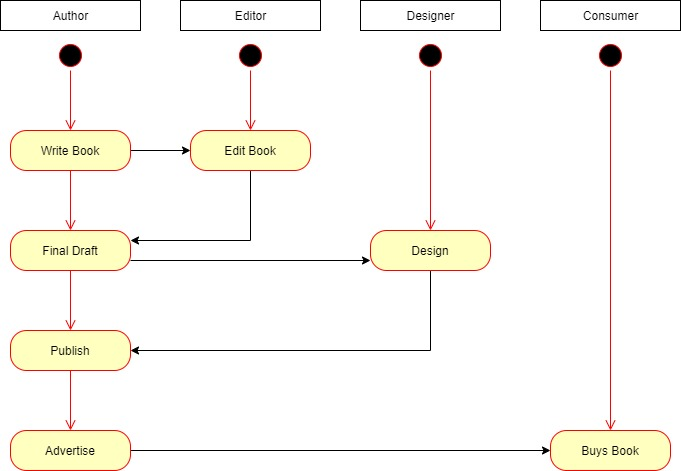
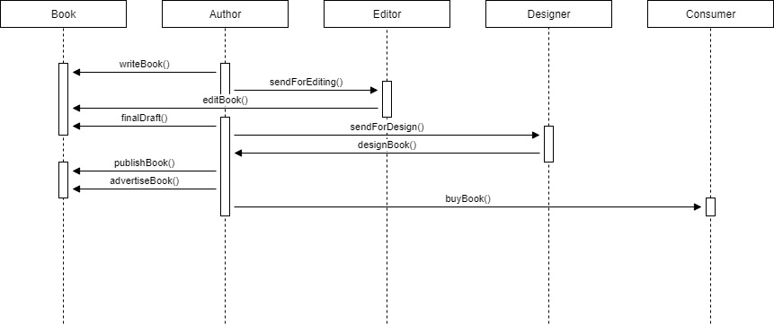
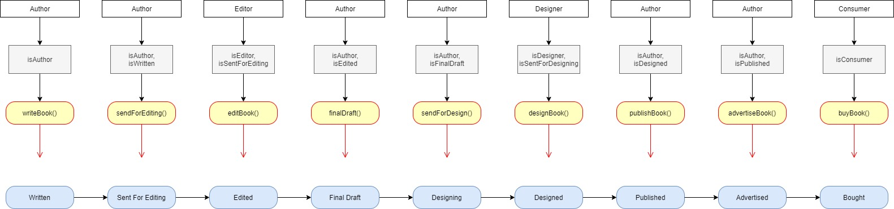
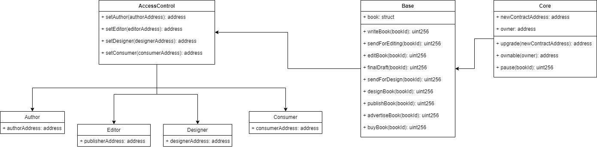

## Information

### Versions
```
Truffle v5.1.20 (core: 5.1.20)
Solidity v0.5.16 (solc-js)
Node v10.15.0
Web3.js v1.2.1
```

### Contract Address
0xdeef19c0c95ecd9466a06fbe18189c9450ae9095887acb0b5b4d2eb03946b3bf on the Ropsten test network.

### UML

#### Activity Diagram


#### Sequence Diagram


#### State Diagram


#### Data Model


### Libraries
The roles library was used to manage actors on the supply chain.

## Installing

Download and extract this repository.  Once in the root folder, run:

```
cd project-6
npm install
```

In a separate terminal window, compile smart contracts:

```
truffle compile
```

This will create the smart contract artifacts in folder ```build\contracts```.

Migrate smart contracts to the locally running blockchain:

```
truffle migrate
```

Test smart contracts:

```
truffle test
```

All 11 tests should pass.

In a separate terminal window, launch the DApp:

```
npm run dev
```

## Built With

* [Ethereum](https://www.ethereum.org/) - Ethereum is a decentralized platform that runs smart contracts
* [Truffle Framework](http://truffleframework.com/) - Truffle is the most popular development framework for Ethereum with a mission to make your life a whole lot easier.


## Acknowledgments

* Solidity
* Ganache-cli
* Truffle
* IPFS
